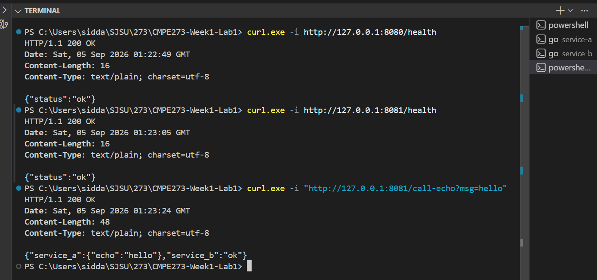
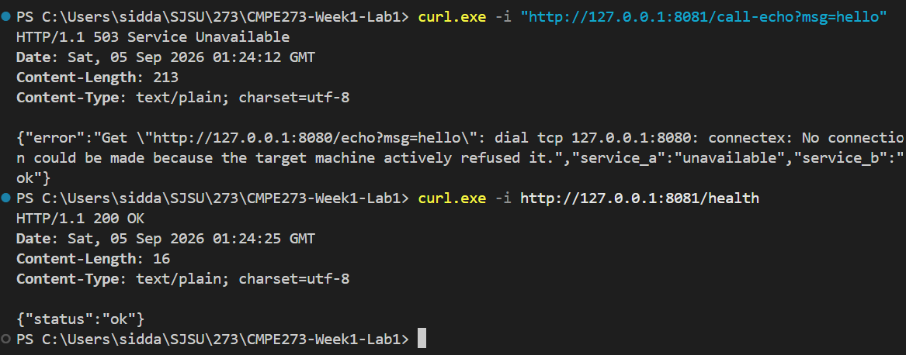

# CMPE 273 Week 1 Lab 1: Two HTTP Services

## Run locally

### Requirements

- Go 1.22 or newer

The `go.mod` files are already included, so no additional dependencies or module initialization are required.

Open a terminal and start Service A:

```powershell
cd service-a
go run .
```

Open a second terminal and start Service B:

```powershell
cd service-b
go run .
```

Each service logs the service name, requested endpoint, HTTP status, and request latency.

## Success proof

With both services running, test their health endpoints and call Service A through Service B:

```powershell
curl.exe -i http://127.0.0.1:8080/health
curl.exe -i http://127.0.0.1:8081/health
curl.exe -i "http://127.0.0.1:8081/call-echo?msg=hello"
```

The health requests return `200 OK`, and the final response contains the echoed message from Service A.



## Independent-failure proof

Stop Service A with `Ctrl+C` while leaving Service B running. Then repeat the echo call and check Service B's health:

```powershell
curl.exe -i "http://127.0.0.1:8081/call-echo?msg=hello"
curl.exe -i http://127.0.0.1:8081/health
```

The dependent request returns `503 Service Unavailable` because Service A cannot be reached. Service B continues running and its own health endpoint still returns `200 OK`.



## What makes this distributed?

This application is distributed because Service A and Service B run as independent operating-system processes and communicate through HTTP rather than an in-process function call. Each service has its own port, lifecycle, and failure boundary: when Service A is stopped, Service B remains healthy while requests that depend on Service A return a controlled `503 Service Unavailable` response.
